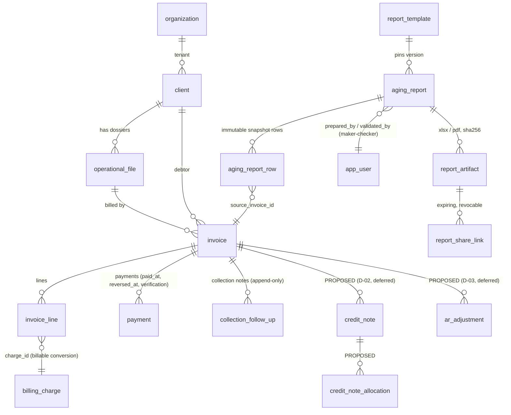

# FIN-AGING-0 · Deliverables B, C, D — Mapping, ERD, Schema Proposal

**No migration is written by this phase.** This is the reviewed design the migration will
implement after ratification.

## B. Source-to-target mapping (workbook → platform → renderer)

| Workbook field | Source (existing unless *proposed*) | E/C | Validation | Renderer destination |
|---|---|---|---|---|
| Facture | `invoice.invoice_number` | system / legacy-import | unique per tenant | `Données Brutes!A`, `Dossiers Critiques!A` |
| Date édition | `invoice.issue_date` | system / legacy-import | ≤ due date | `…!B` (numFmt 14) |
| Échéance | `invoice.due_date` | terms or keyed | ≥ issue date; null → exception list | `…!C` |
| Dossier | `operational_file` via `invoice.file_id` | selected | same-tenant FK | `…!D` |
| Client | `client` via `invoice.client_id` | selected | same-tenant FK, active | `…!E`, `Analyse!A`, `Graphiques!A32:A41` |
| Montant (FCFA) | derived: `invoice_line` − non-reversed `payment` as of arrêté (calc spec §3) | **calculated** | > 0 to appear | `…!F`, `Analyse!C`, `Graphiques!C4:C10·B32:B41`, KPI cards |
| Jours retard | derived | calculated | integer | `…!G` |
| Tranche | derived | calculated | 7-label vocabulary | `…!H`, dashboard rows, chart categories |
| Risque | derived | calculated | 5-label (plain) / emoji (dashboard) | `…!I`, dashboard col G |
| Commentaires | `collection_follow_up.note` → snapshot copy *(Q-10)* | entered | bounded text | `Dossiers Critiques!H` |
| Date d'arrêté | `aging_report.reporting_date` *(proposed)* | report parameter | valid date, ≤ today+0 (Q-02 for future-dated) | three tab titles |
| Client aggregates | derived per calc spec §5 | calculated | Σ part = 100% | `Analyse Clients` B–G, TOTAL row |
| Bucket aggregates | derived per calc spec §7 | calculated | invariants §9.11 | dashboard table, `Graphiques` blocks, charts 1–2 |
| KPI cards | derived | calculated | tie-outs | dashboard row 5 |
| Top-10 | first 10 client aggregates | calculated | consistent with Analyse | `Graphiques!A31:C41` + chart 3 |

## C. Finance ERD (aging scope)



Reused as-is: `organization`, `client`, `operational_file`, `invoice`, `invoice_line`,
`billing_charge`, `payment`, `collection_follow_up`, `app_user`, `audit_log`.
Proposed (this module): `report_template`, `aging_report`, `aging_report_row`,
`report_artifact`, `report_share_link`.
Proposed-but-deferred (architectural provision only): `credit_note`,
`credit_note_allocation`, `ar_adjustment`.

## D. Schema proposal (tables to be created by FIN-AGING-1 *after* ratification)

### `report_template` — versioned template registry
```
id uuid PK · tenant_id uuid NULL (NULL = platform-wide) · code text ('AGING_BALANCE')
version int · title_fr text · renderer_key text ('aging-xlsx-v1' | 'aging-pdf-v1')
config jsonb (bucket scheme, labels, palette — the workbook constants as DATA)
status text CHECK (ACTIVE | RETIRED) · created_at
UNIQUE (code, version) · prevent_mutation trigger on rows once referenced
```
Precedent: `brand_template`, `expense_template`. A template row is append-only once any
report pins it; template evolution = new version row, never an edit.

### `aging_report` — the report + its lifecycle
```
id uuid PK · tenant_id · report_number text (per-tenant sequence, invoice_counter pattern)
reporting_date date NOT NULL           -- la date d'arrêté
currency text NOT NULL DEFAULT 'XOF'   -- one report = one currency (v1)
status text CHECK (DRAFT | VALIDATED | FINAL | SUPERSEDED | CANCELLED)
template_id uuid FK report_template    -- pinned at creation
filters jsonb                          -- population filters used (if any)
totals jsonb                           -- KPI + bucket aggregates, frozen at snapshot
prepared_by uuid FK app_user · prepared_at
validated_by uuid FK app_user · validated_at   -- maker-checker: validated_by <> prepared_by (trigger)
finalized_by uuid · finalized_at
superseded_by uuid FK aging_report     -- the newer FINAL for the same reporting_date
cancel_reason text · created_at · updated_at
UNIQUE (tenant_id, report_number)
Partial unique: at most ONE FINAL per (tenant_id, reporting_date, currency)
  — a re-issue SUPERSEDES the old one explicitly, never silently replaces it
Lifecycle transitions enforced by trigger; FINAL/SUPERSEDED rows immutable
  (prevent_mutation except the status flip FINAL→SUPERSEDED + superseded_by)
```

### `aging_report_row` — pinned source data (Données Brutes, frozen)
```
id uuid PK · tenant_id · report_id FK aging_report ON DELETE RESTRICT
source_invoice_id uuid FK invoice NULL      -- NULL only for legacy rows imported before cutover
invoice_number text · issue_date date · due_date date
dossier_reference text · client_id uuid · client_name text   -- name copied: a later client
                                                             -- rename must not rewrite history
outstanding numeric(14,2) CHECK (> 0)
days_overdue int · bucket text · risk text   -- stored ON THE SNAPSHOT ONLY (never on invoice)
comment text                                 -- Commentaires as captured at snapshot (Q-10)
row_order int                                -- exact rendered order
UNIQUE (report_id, source_invoice_id) · UNIQUE (report_id, row_order)
Append-only once the report leaves DRAFT (trigger keyed on parent status)
Index (report_id), (tenant_id, source_invoice_id)
```
Client/bucket aggregates are **recomputed from rows** by the view model at render time and
cross-checked against `aging_report.totals` — two derivations, one invariant, so a snapshot
can prove its own consistency forever.

### `report_artifact` — generated files (UAT-2B pattern, report-scoped)
```
id uuid PK · tenant_id · report_id FK · format text CHECK (XLSX | PDF)
storage_path text · content_sha256 text · byte_size int
renderer_key text · rendered_at timestamptz · rendered_by uuid
UNIQUE (report_id, format)      -- rendered once; re-download streams the same bytes
Delete-protected (trigger), like the official-invoice artifact
```

### `report_share_link` — secure external sharing
```
id uuid PK · tenant_id · artifact_id FK report_artifact
token_hash text UNIQUE          -- token never stored in clear (card-token discipline)
recipient_email text NULL · password_hash text NULL (optional, Q-11)
expires_at timestamptz NOT NULL · revoked_at timestamptz · revoked_by uuid
created_by uuid · created_at
download_count int NOT NULL DEFAULT 0 · last_downloaded_at
Constraint: only artifacts of FINAL reports may be shared (trigger join on aging_report.status)
Every download audited (audit_log + counter); uniform-404 for invalid/expired/revoked
```

### Existing-table touches (additive, minimal)
- `invoice.source` text NULL — provenance marker for legacy-imported invoices
  (`OPENING_IMPORT`), pending D-01. **No other invoice change.** In particular:
  no stored aging fields on `invoice` — derived-only, matching the workbook.
- No change to `payment`, `client`, `operational_file`, `collection_follow_up`.

### RLS posture (uniform with the platform)
All five new tables: RLS enabled; SELECT for `authenticated` restricted to
`tenant_id = auth_tenant_id()` (report reads additionally gated in the app layer by
`finance:aging:read`); **no INSERT/UPDATE/DELETE policies** — writes go through
service-role server actions behind `assertPermission`, like every finance table.
`report_share_link` gets **no** anon SELECT: the public download route resolves the token
via a service-role lookup with uniform-404, exactly like `/card/[token]`.
Append-only boundaries and lifecycle legality live in DB triggers (WES-9A discipline:
a mandatory guard that fails aborts the write).

### Numbering
`aging_report.report_number`: `EFT-BAL-{YYYY}-{seq}` via a cloned per-tenant counter RPC
(same locked-counter pattern as `next_invoice_number`). Exact format: decision D-10.
