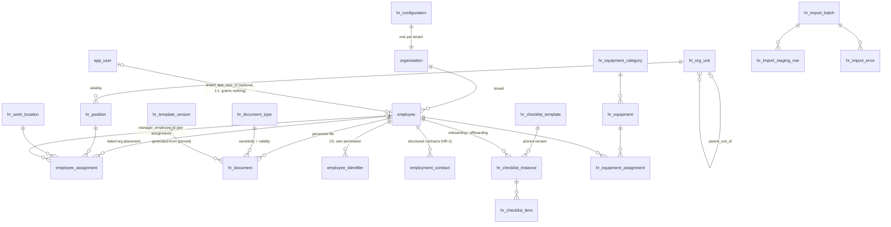

# HR — ERD, Roadmap, Decision Register, Questions, Recommendation

Part of [HR-0R](hr-0r-reaudit-2026-07-31.md) · documentation only.

## 1. ERD (proposed; classifications per entity)

| Entity | Class | Purpose / notes (sensitivity · lifecycle · RLS) |
|---|---|---|
| `employee` | **EXISTING** | the registry; C1/C2; five-state lifecycle; `hr:read` SELECT |
| `employee_counter` | **EXISTING** | numbering; locked, no policies |
| `hr_configuration` | **NEW** (HR-1B) | one row/tenant; DRAFT→ACTIVE; config permission |
| `hr_org_unit` / `hr_position` / `hr_work_location` | **NEW** (HR-1B) | tenant org catalogs under the canonical vocabulary; C1; flag-inactive, never deleted once referenced |
| `employee_assignment` | **NEW** (HR-1B) | dated placement (unit, position, manager, location, kind); C2; one open row per employee; append-and-close, audited — materializes DEC-B63's deferred history |
| `employment_contract` | **NEW** (HR-2) | structured contract metadata + document ref; C2; maker-checker verification |
| `hr_document_type` / `hr_document` | **NEW** (HR-2) | personnel file; C2/C3 by type; soft delete; hash; expiry; dedicated private bucket |
| `employee_identifier` | **NEW** (HR-2+, legal-gated) | CNI/passport/IPRES/CSS/IPM numbers; **C3**; own permission; values never audited |
| `hr_template_version` | **NEW** (HR-2) | tenant-owned versioned templates; immutable once referenced |
| `hr_checklist_template/_instance/_item` | **NEW** (HR-3) | on/offboarding; C1; instance pins template version |
| `hr_equipment_category/_equipment/_equipment_assignment` | **NEW** (HR-3) | assets; C1; return recorded, unreturned blocks checklist |
| `hr_import_batch/_staging_row/_error` | **NEW** (HR-1C) | one generalized pipeline (FIN-AGING-2 shape); staging `raw` is C2/C3 → purge policy required |
| `hr_leave_*` | **NEW** (HR-4) | categories/entitlements (config) + requests/balances; ON_LEAVE stays derived |
| `employee_compensation` / `employee_bank_account` / `employee_benefit` | **NEW** (HR-7) | **C3**; own permission pair; Finance sees interface outputs only |
| `employee_status_history` | **REJECTED — superseded 2026-07-31** | the *status-only* history stays rejected; the governance addendum ratified the broader **`hr_employee_event`** cross-domain ledger (WES-9 idiom) instead — see [hr-governance-addendum-2026-07-31.md](hr-governance-addendum-2026-07-31.md) §7 |
| `hr_employee_event` | **NEW** (HR-1, ratified) | append-only employment ledger feeding the Employee Timeline; `prevent_mutation`; C3 values never in payloads (a salary revision carries kind + date, never the amount) |
| `employee_contact` / `employee_emergency_contact` | **REJECTED** | columns exist on `employee`; fragmentation without a privacy gain (emergency contact is C2 either way) |
| `employee_note` | **REJECTED for now** | free-text HR notes are a liability magnet; revisit with the disciplinary domain (HR-6) where notes get a classification and a gate |
| `employee_audit_view` | **REJECTED** | query `audit_log`; views that duplicate audit invite divergence |
| `employee_employment` (separate table) | **REJECTED** | DEC-B62's rehire-as-new-record + `employee_assignment` history covers multi-period employment without splitting the master |

Every NEW table: tenant-scoped, tenant-match trigger, SELECT-only RLS on its class's
permission, service-role writes, registered in `lib/db/tenant-tables.ts` (leak-guard) and
in the CI RLS suite (appended last, per the standing rule).

## 2. Roadmap — re-based on what is actually built

> **Superseded 2026-07-31**: management ratified a renumbered roadmap (HR-1 = Dashboard +
> Organization Foundation, …, HR-9 = Reporting & Analytics) in
> [hr-governance-addendum-2026-07-31.md](hr-governance-addendum-2026-07-31.md) §11, which
> is now authoritative. The table below is retained as the pre-ratification proposal.

| Phase | Scope | Status |
|---|---|---|
| HR-0 | first audit | **DONE** (2026-07-24, ratified DEC-B59–B63) |
| HR-1 | Employee Registry | **SHIPPED** (migration 57, live) |
| **HR-0R/0A** | this re-audit + setup/migration addendum | **THIS DOCUMENT SET** |
| **HR-1B** | Organization & configuration foundation: `hr_configuration` + org catalogs + `employee_assignment` + setup wizard (org/numbering/vocabulary steps) + number-immutability trigger | next implementation phase |
| **HR-1C** | Legacy import: the generalized pipeline + `EMPLOYEES`/org-kind imports + activation checklist | |
| HR-2 | Documents & contracts: `hr_document(_type)`, `employment_contract`, `employee_identifier` (legal-gated), templates, private bucket | |
| HR-3 | Onboarding/offboarding execution: checklists, equipment, account-step integration | |
| HR-4 | Leave (categories/entitlements from config; ON_LEAVE derived) | |
| HR-5 | Attendance & timesheets | |
| HR-6 | Performance, training, disciplinary (restricted) | |
| HR-7 | Payroll preparation: compensation domain (C3) + Finance interface | |
| HR-8 | Self-service (`SELF` scope helper) | |
| HR-9 | Reports (aggregates, k-anonymity), UAT, rollout | |

Recruitment/candidate (ATS) has no repository trace and no ratified phase — listed as an
HR-10 candidate pending management demand; building it before operational HR runs would
invert the value order.

## 3. Decision register — items requiring ratification (HRQ-*)

| # | Item | Recommendation |
|---|---|---|
| HRQ-A1 | Employment statuses tenant-configurable? | **No** — engine (DEC-B62 machine); tenants configure vocabulary (reason codes, labels). Divergence from the HR-0A request, stated openly. |
| HRQ-A2 | Numbering pattern configurable pre-activation, locked after | Yes as designed; renumbering live staff rejected |
| HRQ-A3 | Sub-departments as `hr_org_unit` under the fixed canonical 4 (registry unchanged) | Yes — the only design that preserves WES-3 |
| HRQ-A4 | Staging `raw` retention (holds C2/C3) | purge N days after batch approval/rejection; N to be set with legal |
| HRQ-D1 | Termination-reason vocabulary (field dictionary §4) | ratify list |
| HRQ-D2 | Permission ceiling: add `hr:sensitive:read` + `hr:config:manage` (11 total) or fold both | **widen to 11** — folding sensitive-identity reads under documents weakens the strongest boundary |
| HRQ-D3 | Dotted-line manager | do not model until a consumer exists |
| HRQ-D4 | CEO confidential access | aggregates + C1 only unless explicitly granted per domain |
| HRQ-D5 | Acting-manager semantics (flag on assignment) | as designed |
| Carried | All DEC-B63 legal items (contract types, identifiers, leave, retention) | unchanged, still gating HR-2+ |

## 4. Questions for Effitrans HR & management (do not block architecture)

Headcount and the account-less share (drivers/journaliers)? · real unit/team structure
under the canonical four? · position list + grades? · reporting lines (who manages whom,
acting cases)? · keep `EMP-{YEAR}-{NNNN}`? · contract types actually used + probation
practice per type? · which documents are mandatory per hire, and which expire? · leave
categories and entitlements practiced today? · attendance method (none/manual/device)? ·
payroll operator today (external? DAF?) and what preparation data they need? · who besides
HR_OFFICER may read what (matrix sign-off)? · onboarding task owners (IT? Administration)?
· offboarding approval chain? · retention duties for personnel files? · who is the HR
administrator (wizard operator)? · which executives, if any, may open confidential records,
per domain?

## 5. Risks

Legal exposure from premature C3 collection (mitigated: absence is test-enforced until
review) · configuration sprawl (mitigated: engine/config boundary + activation checklist)
· import quality — the first employee load defines HR's credibility (mitigated: staging +
maker-checker + preview; same rails that protect the aging import) · permission-ceiling
erosion (mitigated: HRQ-D2 is the only widening path) · manager-scope leakage (mitigated:
scopes deferred until the assignment model is live and helpers are tested) · the
two-person-lists confusion — `/users` vs the directory (mitigated: link + distinct
surfaces, already the shipped design).

## 6. Recommendation

**For "HR-1 — Employee & Organization Foundation" as this mission defines it: CONDITIONAL
GO.** The employee half is live; the organization/configuration half (HR-1B) and the
import path (HR-1C) are well-specified above and reuse proven idioms end to end. The
conditions:

1. **HRQ-A1** (statuses stay engine) and **HRQ-A3** (org units under the fixed canonical
   registry) — both shape the first migration.
2. **HRQ-D2** (permission ceiling 9 → 11) — decides the config surface's gate before it is
   built.
3. The **HR-management question set** above answered at least for: unit/position structure,
   numbering keep/change, and who operates the wizard.

Nothing else blocks. HR-1B/1C touch no existing HR behaviour, no canonical registry, and no
production data; they follow the standing operational rules (additive migration, RLS suite
appended last in CI, parity trio, docs-first ratification — and they queue behind the
already-pending operator sequence 68→72).
