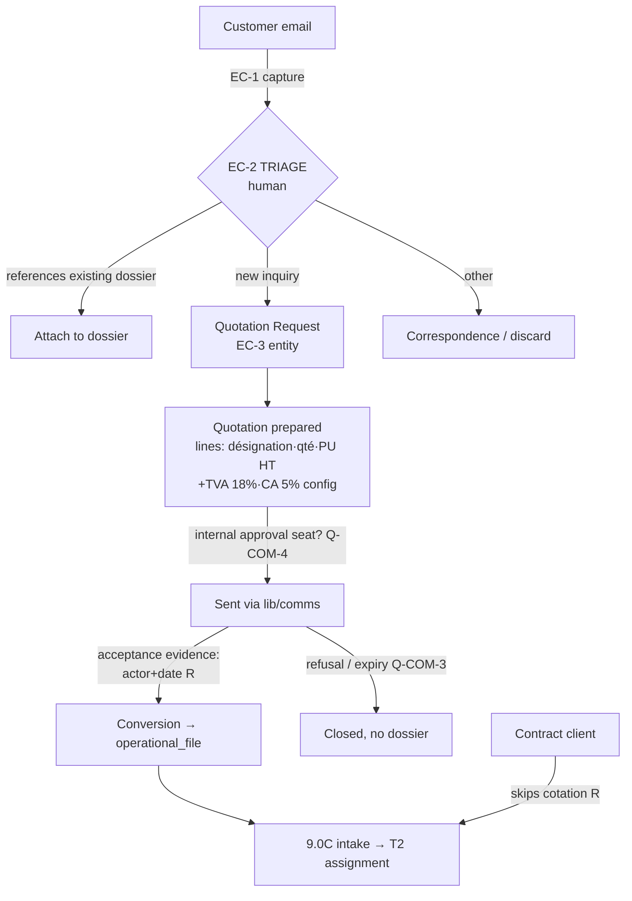

# LOG-0 — Quotation-to-Dossier Analysis

The customer-email → dossier journey, from what the sources actually evidence, compared
against EC-0 and the ratified process registry. Tags: **[O]** observed · **[R]** ratified
· **[I]** inferred · **[Q]** management question.

## 1. What the sources add

**The line model is now evidenced [O].** MODELE FACTURE's DEVIS tab (FCFA,
Senegal-localized):

| Field [O] | Note |
|---|---|
| Numéro, Date | numbering scheme itself not evidenced [Q-COM-2] |
| Line: Désignation · Qté · PU HT · Total HT | quotation and invoice share ONE line shape [O] — strong argument for a shared line model at conversion |
| TOTAL HT → **TVA 18%** → **CA 5%** → Net à payer | the two Senegalese levies appear as first-class rows [O]; rates are configuration, **never hardcoded** [R discipline] |
| «Arrêté le présent devis à la somme de…» (amount in words) | required rendering feature [O] |
| RIB block (banque, code agence, compte, clé) | on both DEVIS and FACTURE [O] |
| «LE DIRECTEUR GÉNÉRAL» signature seat | a named approval seat exists on the *document* [O]; who approves the *quotation* internally is not evidenced [Q-COM-4] |

**Facture Pro Forma [O]** exists as a distinct template alongside Facture Commerciale —
confirming the platform's existing `PROFORMA_INVOICE` vs `COMMERCIAL_INVOICE` split [R].

**What Operations needs to quote** — the KIT templates converge on: parties,
description of goods, packages/weight/volume, declared value + currency, origin/
destination, mode, Incoterm [O across Connaissement/Facture/Colisage]. This matches the
9.0C intake fields almost exactly [R] — evidence that quotation intake and dossier
intake share a data spine.

**Documents accompanying a request [I]:** proforma/commercial invoice + packing list at
minimum (they carry the value and volume a price needs); BL/AWB when goods are already
moving. The 9.0C rule "documents often do not exist at intake" stays true [R].

## 2. What remains unevidenced (and must not be invented)

Validity period · internal approval workflow and thresholds · acceptance evidence
format (signed devis? email? — the process registry demands `client_approval_actor` +
`client_approval_date` [R] but the kit shows no acceptance artifact) · quotation
numbering · versioning/amendment · rejection/negotiation loop · pricing sources
(tariff grids, margins — **nothing** in the pack prices anything). Each → questionnaire.

## 3. The journey, reconciled with EC-0 [R] + sources [O]

Nothing in the pack contradicts EC-0's capture-then-triage doctrine; the Registre de
courriers workbook actively **confirms** it (mail is registered first, routed second).

## 4. Fields that should transfer at conversion [O+R]

Client · origin/destination · mode · goods description · packages/weight/volume ·
declared value/currency · Incoterm · references — i.e. the quotation carries the 9.0C
intake spine, so conversion is a projection, not a re-keying. The quotation lines
themselves become the **billing seed** (same line shape as the invoice [O]) — but
whether the final invoice must equal the accepted quotation is a management rule
[Q-COM-6], not an assumption.

## 5. Contract clients [R + Q]

`client.has_contract` remains the ratified missing flag; intake already skips cotation
by default [R]. The kit's 22 customs agreements suggest contract *kinds* matter
(representation en douane vs transit commission…) [I] — whether the platform needs
kind-level distinction or one boolean is Q-COM-7.

## 6. Correspondence vs new quotation

The letters give concrete examples of mail that must **attach**, never quote: claim
notices, delivery-delay notices, return authorizations [O]. Detection stays human
(EC-2), with file-number matching as an AI *suggestion* later (EC-5) [R doctrine].

## 7. Verdict for EC-3

The sources **strengthen** EC-0's design and supply the missing line-level detail.
EC-3 can be specified once Q-COM-1..7 (see questionnaire) are answered. **No change to
the EC-3 boundary:** pricing tariffs, margin rules and approval thresholds stay
management-ratified configuration, never code defaults.
