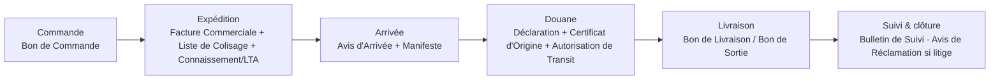

# LOG-0 — Workflow Catalog

**Honesty note first.** The pack contains templates and tools, not SOPs, so full
workflows (trigger → owner → approvals → completion) are mostly **not reconstructible
from this source alone**. What the sources *do* support: (a) document-set-per-stage
workflows implied by the KIT TRANSIT templates, (b) exception-path communication
workflows implied by the correspondence letters, (c) register workflows implied by the
workbooks' structure. Everything below is tagged: **[O]** observed · **[R]** already
ratified in the repo · **[I]** inferred · **[Q]** needs management validation.

## W-1 — Import shipment document flow [O structure / R sequence]

The template set covers the exact document chain the ratified 26-step process
(`lib/process/effitrans-process.ts`) already encodes. The pack **confirms** the
platform's document doctrine rather than extending it:

Insurance documents (certificat, déclaration, police cargo) attach at expédition [O].
**Missing from the pack** that the platform already has [R]: BAE, quittances, DPI/APE,
exonérations, sommier — the Senegal-specific customs chain. The kit is generic; the
platform is already *more* specific than the kit.

## W-2 — Procurement exception paths [O letters / I flow]

The folder-2 letters enumerate a vendor-side exception vocabulary. Each letter = one
transition in an implicit receiving workflow:

| Letter [O] | Implied state transition [I] |
|---|---|
| Accusé de réception de marchandise | goods received — OK |
| Notification de livraison incomplète | received — partial |
| Avis de rejet de marchandises | received — rejected |
| Notification de produits défectueux | received — defective |
| Non-livraison | not received by due date |
| Avis d'expédition | vendor announces shipment |
| Bienvenue nouveaux fournisseurs | vendor onboarding exists [I] |

**Incomplete:** who inspects, who authorizes rejection, deadlines, escalation — none
evidenced. → Questionnaire Q-PROC-1..3. **Platform coverage:** no procurement module
exists; these letters would be outbound `lib/comms` templates if the domain is ever
built.

## W-3 — Sales/expedition exception paths [O letters / I flow]

Folder-3 mirrors W-2 from the seller side: order acknowledgment → (verbal-order
confirmation with a **10-day silent-acceptance rule** — the only explicit SLA-like rule
found in any letter [O]) → delivery by lots · substitution · delayed shipment ·
execution incapacity · return authorization (incl. late returns). **Incomplete:**
approval authority for returns and substitutions [Q].

## W-4 — Mail register (Registre de courriers) [O structure]

The one artifact that maps directly onto EC. Sheets: Arrivée · Départ · **Délais** (with
`Délai légal en jours`, `Date limite de réponse`, criticité) · Supports (électronique /
postal / télécopie) · Services · Rédacteurs · Statistiques both ways.

Implied workflow [I]: mail arrives (any support) → registered with chrono number →
routed to a service → a response deadline is tracked → outbound response registered →
statistics. **This is EC-2's triage loop, plus two things EC does not have: POSTAL mail
and legal response deadlines.** → Q-COMM-1..3.

## W-5 — Quotation → invoice [O fields]

From MODELE FACTURE (DEVIS + FACTURE tabs, FCFA): line items (désignation, qté, PU HT),
TOTAL HT, **TVA 18% + CA 5%**, Net à payer, amount-in-words («Arrêté la présente facture
à la somme de…»), full RIB block, «LE DIRECTEUR GÉNÉRAL» signature seat [O].
The DEVIS tab carries the same shape — **quotation and invoice share one line model**
[O]. No validity period, no approval step, no versioning evidenced [Q].
Detail in [quotation-to-dossier-analysis.md](quotation-to-dossier-analysis.md).

## W-6 — Register workflows from the freeware tools [I only]

EPI issue/return per agent ≈ HR-4 equipment custody [R] · training requests →
sessions ≈ HR-6 [R, partially: the *request* stage is employee-initiated, which HR-6
deferred as HRQ-P1] · caisse recettes ≈ 9.3A [R shell] · notes de frais with mileage ≈
11.0B/C [R, mileage absent] · stock in/out/inventory ≈ **no module** · vehicle
reservation calendar ≈ transport [partial].

## Workflows NOT reconstructible (and not invented)

Operations intake internals beyond what 9.0C already ratifies · customs decision
authority · vendor selection/qualification · warehouse physical processes · complaint
resolution beyond the two Avis letters. Each generates questionnaire entries instead of
invented steps.
