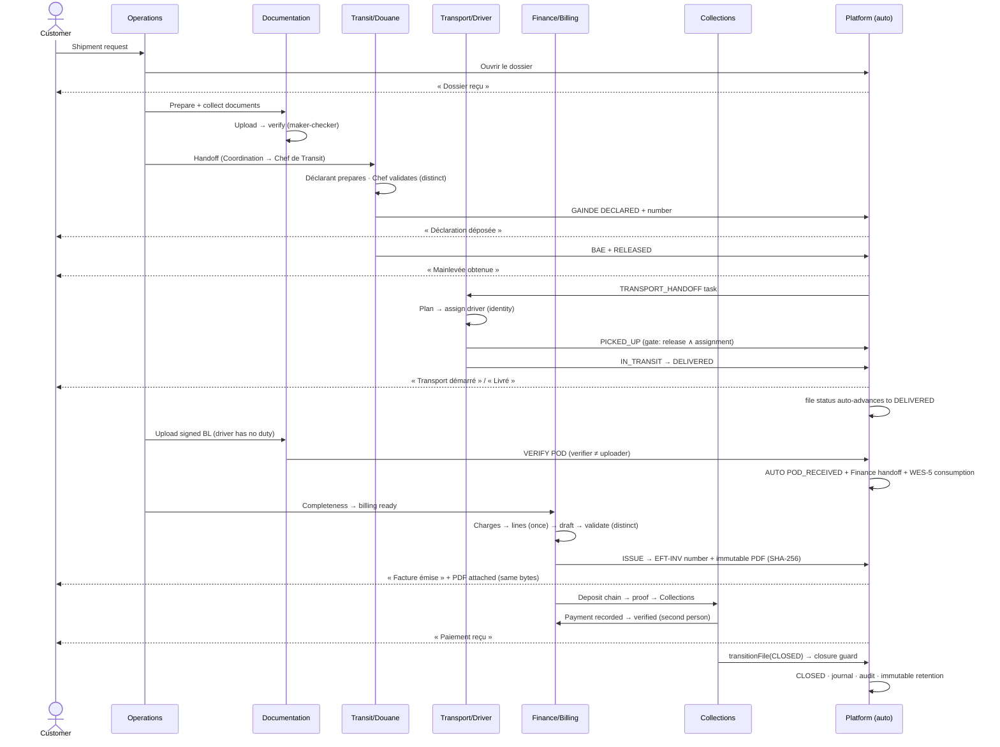

# Effitrans Operations Platform — The Complete Business Workflow

**Date:** 2026-07-28 · **Source of truth:** the production implementation at commit `3d5fefe`
**Method:** reverse-engineered from `lib/process/effitrans-process.ts` (the 26-step registry), the module state machines, the automation services, and the UAT-validated production behaviour. **Nothing in this document is aspirational** — every step, status, gate and notification below exists in code and has a named enforcement point.

Related: [`wes-0-canonical-workflow-architecture.md`](wes-0-canonical-workflow-architecture.md) · [`wes-5-reconciliation.md`](wes-5-reconciliation.md) · [`../rbac-matrix.md`](../rbac-matrix.md)

---

## 1. Executive summary

A dossier travels through **five file statuses** (`DRAFT → OPENED → IN_PROGRESS → DELIVERED → CLOSED`), **26 official process steps** across **11 operating functions**, and **four module state machines** (documents, customs, transport, finance) that feed one canonical lifecycle projection.

The doctrine, ratified in WES-0 and enforced since WES-5:

> **External evidence → module records → process engine → canonical projection → every UI.**
> Departments own dossiers. People own tasks. Drivers own missions.
> Modules never command the engine; the engine consumes evidence.

Five properties distinguish the implemented workflow from a paper process:

1. **Evidence-driven automation.** Five process steps complete automatically from module facts (dossier opened, GAINDE declared, customs released, pickup, POD received). Verifying the signed delivery note *is* the decision; the platform records POD receipt, advances the dossier status, fires the Finance handoff and reconciles the engine — no redundant clicks.
2. **Maker-checker at every money and control point.** Customs dossier: prepared by the Déclarant, validated by the Chef de Transit (distinct actor enforced). Invoice: drafted by Facturation, validated by Finance (distinct actor enforced). Payment: recorded, then verified by a second person. Documents: uploaded by one person, verified by another.
3. **Immutable records.** The operational journal (`business_event`) is append-only and emitted in the same database transaction as the fact. The official invoice PDF is rendered once at issuance, SHA-256-hashed, and can never be regenerated, altered or deleted. Assignment history, evidence consumption and state history are append-only ledgers.
4. **One operational truth.** The canonical dossier state is computed from complete, permission-independent reads. RBAC decides which panels, actions and sensitive fields a user sees — never what the workflow state *is*.
5. **Hard closure.** A dossier cannot be closed until customs is released (or waived), delivery is complete, at least one non-void invoice exists and is settled, and **every payment is verified**. The gate is enforced server-side and names the exact unmet requirement.

**Terminal state today:** `CLOSED` (« Clôturé »). A distinct `ARCHIVED` status, the archive workspace and retention policy are a **deferred phase** — "archival" in the current system means process step 23's dossier archiving by the Administration plus the terminal `CLOSED` status, with all documents, invoices and history retained and downloadable indefinitely.

---

## 2. The complete numbered workflow

Legend: **Auto** = completed automatically from module facts (WES-5 reconciliation or a dedicated automation). Roles are the registry's business seats; §10 maps them to RBAC role codes.

| # | Department | Responsible role | Input | Process | Output | Next |
|---|---|---|---|---|---|---|
| 0 | Commercial / Customer | Customer (portal or contact) | Shipment need | Customer requests a shipment; a staff member creates the dossier shell (`operational_file`, status `DRAFT`, file number `EFT-{type}-{year}-{seq}` allocated) with client, type (IMP/EXP/TRP/HND) and shipment data | `DRAFT` dossier + `shipment` row | 1 |
| 1 | Cotation | Cotation officer | Customer request | Establish the quotation and obtain approval — **or skip**: for contract clients, opening skips cotation explicitly (`SKIPPED`, reasoned, audited) | `QUOTATION`, `QUOTATION_APPROVAL` (or reasoned skip) | 2 |
| 2 | Operations | Responsable des Opérations | Approved/contracted request | **« Ouvrir le dossier »** — one orchestrated action: process instance created (policy version pinned), canonical Operations owner assigned, cotation skipped if applicable, step 2 activated (`PENDING→AVAILABLE→ACTIVE` entry path), file `DRAFT→OPENED`, customer milestone **« Dossier reçu »** published once | Live process instance; owner; customer notified | 3 |
| 3 | Account Management | Account Manager | Owned dossier | Open and prepare the dossier: collect transport request, delivery slip, vendor invoice, spending authorization; documentation assembly begins | Preparation documents; **Auto:** `am_dossier_opening` completes from the fact the file left `DRAFT` | 4 |
| 4 | Coordination | Coordinateur | Prepared dossier | Confirm reception; formally transmit to the Chef de Transit (engine handoff: idempotent, explicit reception, refused while an intake blocker is open) | `process_handoff` → Transit; `CUSTOMS_HANDOFF` task | 5 |
| 5 | Transit | Chef de Transit | Handoff | Receive; assign the Déclarant (atomic assignment RPC, append-only `assignment_event`) | Declarant assigned | 6 |
| 6 | Customs declaration | Déclarant | Assigned dossier | Prepare the customs clearance dossier (`customs_record` created, `CUSTOMS_DOSSIER` assembled) | Customs dossier submitted for validation (`SUBMITTED`) | 7 |
| 7 | Transit | Chef de Transit | Submitted customs dossier | **Maker-checker validation** — the validator must be a distinct actor from the preparer (enforced in the engine); rejection returns to step 6 with a structured reason code | Validated customs dossier | 8 |
| 8 | Coordination | Coordinateur | Validated dossier | Transmit to Finance (customs function) | Handoff → Finance | 9 |
| 9 | Finance (customs) | Customs finance officer | Validated dossier | Register the declaration in **GAINDE** (Senegal's customs system); record the declaration number on `customs_record` (status → `DECLARED`) | Declaration number; **Auto:** `gainde_registration` completes from `DECLARED` + number present; customer event `CUSTOMS_DECLARED` | 10 |
| 10 | Coordination | Coordinateur | Registered declaration | Return the dossier to the Déclarant | Handoff → Déclarant | 11 |
| 11 | Customs declaration | Déclarant | Registered declaration | Introduce the supporting documents into GAINDE (submission evidence retained) | GAINDE submission recorded | 12 |
| 12 | Coordination | Coordinateur | Submitted declaration | Follow the customs decision (circuit vert/orange/rouge; `INSPECTION` status when physically inspected); assign the Agent de Terrain | Field agent assigned | 13 |
| 13 | Customs field | Agent de Terrain | Inspection outcome | Obtain the **Bon À Enlever (BAE)** and release the dossier. Two governed acts (WES-4): `record_bae_reference` (evidence), then `record_customs_release` (`customs_record → RELEASED`, requires `customs:release`) | BAE reference + release; **Auto:** `customs_field_clearance` completes from `RELEASED`; customer milestone **« Mainlevée obtenue »**; `TRANSPORT_HANDOFF` task fires | 15 (with 14) |
| 14 ∥ | Transport | Service Transport | Opened dossier (parallel from step 3) | Create `transport_record`; plan (`PLANNED`); assign vehicle + authenticated driver (`DRIVER_ASSIGNED`, `driver_user_id` — identity, not free text); communicate tracking | Assigned transport | 15 |
| 15 | Pickup | Agent d'Enlèvement | **Join gate:** BAE obtained (13) **AND** transport assigned (14); parallel activities Bon à Délivrer + Pre-Gate | Pick up the goods, exit the port (`PICKED_UP`; **server refuses pickup before customs release** for required IMP/EXP) | Pickup confirmed; **Auto:** `pickup` step completes; **Auto:** file `OPENED/IN_PROGRESS` walks toward `DELIVERED` as transport progresses | 16 |
| 16 | Account Management | Account Manager | Goods in transit (`IN_TRANSIT`, customer notified « transport démarré ») | Follow the delivery to customer reception; transport reaches `DELIVERED`; **Auto:** file status advances to `DELIVERED` (ladder walked one legal step at a time, each with history + audit) | Delivery recorded; customer notified « livré » | 17 |
| 17 | Coordination (Operations) | Coordinateur | Delivered goods | **Obtain and have verified the signed BL/POD** (ownership moved from Transport to Operations — most drivers are subcontractors; their duty ends at delivery). Upload `DELIVERY_NOTE` → an authorized *different* person verifies it → **Auto:** transport `DELIVERED→POD_RECEIVED` (same evidence gate as manual), Finance handoff fires once (WES-1D dedup), WES-5 consumes the exact document version | Verified POD; `FINANCE_HANDOFF` task; **Auto:** `transport_pod_handoff` completes | 18 |
| 18 | Coordination | Coordinateur | Verified POD | Verify completeness; attach receipts and payment proofs | Complete dossier | 19 |
| 19 | Account Management | Account Manager | Complete dossier | Final completeness check; transmit to Facturation ("billing ready") | Billing-ready dossier | 20 |
| 20 | Billing | Service Facturation | Billing-ready dossier | Create billable charges (`billing_charge`); convert to invoice lines (**one charge = at most one line, DB-enforced**); draft the invoice; submit for validation (engine `submitStep`) | `DRAFT` invoice | 21 |
| 21 | Finance | Service Finance | Draft invoice | **Maker-checker validation** by a distinct actor; **issuance**: server validates persisted lines (empty/zero/negative/overflow/due-date rejected **before** numbering), allocates the immutable `EFT-INV-{year}-{seq}` number, then **automatically renders the official PDF** — deterministic, SHA-256-hashed, finalized once, never regenerated | `ISSUED` invoice + immutable `OFFICIAL_INVOICE` artifact; customer notified « facture émise » | 22 |
| 22 | Billing | Service Facturation | Issued invoice | **« Envoyer au client »** — attaches the exact stored artifact bytes (never re-rendered); delivery audited with the artifact's SHA-256; unlimited auditable resends; queue for physical deposit | Emailed invoice; deposit queued | 23 |
| 23 | Administration | Service Administratif | Dispatched invoice | Prepare the physical deposit pack; assign a Coursier; archive the dossier documents (deposit chain of custody in `invoice_deposit` + append-only `invoice_deposit_event`) | Courier assigned; dossier archived (administrative) | 24 |
| 24 | Courier | Coursier | Deposit pack | Physically deposit the invoice at the client's offices; upload the proof of deposit | `PROOF_OF_DEPOSIT` document | 25 |
| 25 | Administration | Service Administratif | Proof of deposit | Validate the proof; forward to Recouvrement (engine `submitStep`) | Validated proof → Collections | 26 |
| 26 | Collections | Service Recouvrement | Deposited invoice | Follow payment due dates (`collection_follow_up`); payments recorded (`recordPayment`) then **verified by a second person** (`verifyPayment`); over/duplicate payment refused; reversal audited; on full settlement the collections module calls `transitionFile(…, "CLOSED")` — which passes through the **closure guard** | Payments verified; balance 0; customer notified « paiement reçu » | Closure |
| 27 | Operations / Management | Ops Supervisor, Coordinateur, AM or Admin (`file:transition`) | Settled dossier | **« Clôture du dossier »** → `DELIVERED → CLOSED`. Server enforces: customs released/waived · delivery complete · ≥1 non-void invoice, all settled · **every payment verified**. Refusal names the exact blocker in French | `CLOSED` dossier; lifecycle 100 %; state history + audit + journal | End |
| 28 | Archive (deferred) | — | Closed dossier | **Not yet a distinct status.** The dossier is terminal at `CLOSED`; all documents, the immutable invoice PDF, payments, communications, events and audit remain retained and downloadable (closure never deletes). A true `ARCHIVED` status + archive workspace are a documented future phase | Immutable, retrievable record | — |

---

## 3. Department-by-department workflow

### 3.1 Commercial / Cotation
- **Responsibilities:** quotation and customer approval (step 1); commercial relationship.
- **Inputs:** customer shipment request. **Decisions:** price/terms; contract-client bypass.
- **Documents created:** `QUOTATION`, `QUOTATION_APPROVAL`. **Steps completed:** 1 (or reasoned `SKIPPED`).
- **Entities:** `client`, `client_contact`, `operational_file` (creation), `quotation` data. **Notifications:** none direct.

### 3.2 Operations (Responsable des Opérations)
- **Responsibilities:** intake, opening, canonical ownership assignment (steps 2); overall accountability — under the canonical registry, **Coordination, Account Management and Documentation are all Operations**.
- **Actions:** « Ouvrir le dossier » (validated intake: client, type, mode, owner are blocking; origin/destination/référence/ETA warn), owner selection from OPERATIONS-mapped staff, intake blockers (« document manquant », customer-visible optional).
- **Status changes:** file `DRAFT→OPENED`. **Entities:** `process_instance` (policy-pinned), `process_step_execution` (all nodes materialized), `operational_file`. **Notifications:** « Dossier reçu » to the customer (dedup once), `FILE_ASSIGNED` to the owner. **Approves:** intake completeness. **Steps:** 2.

### 3.3 Account Manager
- **Responsibilities:** dossier preparation and the customer relationship end-to-end (steps 3, 16, 19); delivery follow-up; final completeness.
- **Documents received:** transport request, vendor invoice, spending authorization, delivery slip. **Parallel duties:** Bon à Délivrer from the carrier; terminal Pre-Gate authorization.
- **Steps completed:** 3 (auto from facts), 16, 19. **Entities:** `document`, `task`. **Role:** `ACCOUNT_MANAGER` (holds `file:update` + `file:transition`).

### 3.4 Documentation
- **Responsibilities:** collecting and verifying **documentation-stage** external evidence: Commercial Invoice, Packing List (BL/AWB, certificates, insurance and manifest as provided per shipment). Stage-aware doctrine: a POD (transport-stage) or customs declaration never blocks the documentation stage.
- **Process:** upload (`UPLOADED`) → review (`UNDER_REVIEW`) → **verify** (`VERIFIED`, by `document:approve`, maker-checker: uploader ≠ verifier) or **reject** (structured reason code from the WES-4 taxonomy; free text stays in the protected `document_review` record). Rejected/superseded versions never satisfy requirements.
- **Entities:** `document` (versioned, SHA-256 on upload), `document_review`. **Journal:** `DOCUMENT_UPLOADED`, `DOCUMENT_VERIFIED`, `DOCUMENT_REJECTED`, `DOCUMENT_SUPERSEDED`.

### 3.5 Transit (Chef de Transit)
- **Responsibilities:** customs orchestration (steps 5, 7); declarant assignment; **validation of the customs dossier as a distinct actor**; BAE evidence verification authority (WES-4: record = field agent, verify = Chef de Transit).
- **Decisions:** validate/reject the customs dossier (rejection → step 6 with reason). **Steps:** 5, 7. **Role:** `CHIEF_OF_TRANSIT`. Discovers every dossier with an applicable customs leg (department discovery, migration 69) — current, completed or archived.

### 3.6 Customs / Douane (Déclarant, Customs finance, Agent de Terrain)
- **Responsibilities:** clearance execution — preparation (6), GAINDE registration (9, by the customs-finance function), GAINDE document submission (11), follow-up & inspection (12), **BAE + release** (13).
- **Customs record ladder:** `NOT_STARTED → DECLARED → INSPECTION → RELEASED` (`CANCELLED` abort; `required=false` = documented waiver that skips the leg and the close-guard).
- **Governance:** BAE reference is recorded *evidence*; release is a separate deliberate act under `customs:release`. A released record is protected from deletion (WES-1C). **Journal:** `CUSTOMS_RECORD_CREATED`, `CUSTOMS_STATUS_CHANGED`, `CUSTOMS_DECLARED`, `BAE_RECORDED`, `CUSTOMS_RELEASE_COMPLETED` — all transaction-atomic with the fact.
- **Auto:** steps 9 and 13 complete from the recorded facts. Customer sees « déclaration déposée » and « mainlevée obtenue ».

### 3.7 Transport & Pickup
- **Responsibilities:** vehicle/driver assignment (14), port pickup (15), carriage to delivery. **Transport ladder:** `NOT_STARTED → PLANNED → DRIVER_ASSIGNED → PICKED_UP → IN_TRANSIT → DELIVERED → POD_RECEIVED` (+`BLOCKED`, `CANCELLED`).
- **Gates:** `PICKED_UP` refused before customs release (required IMP/EXP; `customs_override` is the audited exception); `POD_RECEIVED` requires a verified delivery note (`isVerified`: VERIFIED / legacy APPROVED / CONSUMED_AS_EVIDENCE).
- **Driver identity:** `driver_user_id` (authenticated) — assignment is never a free-text name; WES-1E decoupled identity from GPS flags. **Generated artifacts:** `DEMANDE_TRANSPORT` and `TRANSPORT_ORDER` — platform-authored, deterministic, hash-stamped; generation requires `transport:manage` (Finance can view, never generate).
- **Transport's responsibility ends at `DELIVERED`** (UAT-1 redesign). **Auto:** delivery advances the file status; POD receipt is automatic on verification.

### 3.8 Finance, Billing & Caisse
- **Billing (20, 22):** charges → invoice lines (`uq_invoice_line_charge_once`: one economic event billed once, forever; draft deletion is the one legitimate release), draft, dispatch.
- **Finance (21):** distinct-actor validation; issuance validation (server-side, before numbering); the immutable `EFT-INV-…` number; **automatic official PDF** (deterministic renderer, no clock/randomness/Intl; tenant identity printed only where configured — nothing fabricated); the artifact is bound to the invoice (`document.invoice_id`), unique, immutable, undeletable.
- **Delivery:** Finance download, customer-portal download and the emailed attachment all resolve **the same stored bytes** — one SHA-256, verifiable years later. Available after payment, cancellation, closure, archival.
- **Payments:** `recordPayment` (maker) → `verifyPayment` (checker) / `rejectPayment` (reasoned) / `reversePayment` (audited counter-entry). Balance from `invoiceTotals/paidAmount/balanceDue` — one calculator everywhere. **Corrections doctrine:** issued invoices are immutable; corrections = void + new charge + new invoice (credit notes are a future phase).
- **Caisse (CASHIER):** treasury execution only (DEC-C21) — no dossier visibility, no verification authority, by design.

### 3.9 Administration & Courier (23–25)
- Physical invoice deposit chain: prepare pack → assign courier → deposit at client → upload proof → validate → forward to Collections. Chain of custody in `invoice_deposit` + append-only `invoice_deposit_event`.

### 3.10 Collections / Recouvrement (26)
- Follows due dates (`collection_follow_up`), overdue flags, disputes; receives verified payments; on full settlement triggers closure through the guarded `transitionFile`. Feature-flagged (`EFFITRANS_COLLECTIONS_ENABLED` + tenant rollout).

### 3.11 Management
- **CEO / OPS_SUPERVISOR:** executive dashboard (KPIs: per-currency, tenant-timezone windows), Operations cockpit (`/dashboard`), Control Tower funnel & bottlenecks, alert center, read-only Copilots — **all derived from the same canonical state**. `OPS_SUPERVISOR` may advance the ladder (`file:transition`) without editing rights (`file:update`); CEO reads and reports, deliberately without either.

### 3.12 Customer Portal
- Sees: shipment progress (client-safe stages), verified client-safe documents shared with them, invoice center (number, dates, status, total, paid, balance — same finance calculator), **official invoice PDF download** (own client only, uniform 404), messaging, notifications with per-category preferences. Milestones (each dedup-once): « Dossier reçu » → « déclaration déposée » → « mainlevée obtenue » → « transport démarré » → « livré » → « facture émise » → « paiement reçu ».

### 3.13 Driver Mobile App
- **Deliberately minimal.** The driver sees assigned missions (keyed on authenticated `driver_user_id`) with pickup/delivery instructions, and controls **GPS tracking sessions only** (start/pause/resume/stop, flag-gated). **No document upload, no PDF handling, no POD duty, no status transitions** — the office records progress; the driver drives.

### 3.14 Messaging
- Internal Messaging Center: department-scoped conversations (`messaging:read:*`), direct conversations with dedup, searchable recipient picker. Customer communications: templated emails via the provider (now with attachments), every send logged in `communication_message` and surfaced in the dossier's communications timeline.

### 3.15 Archive
- **Today:** administrative archiving inside step 23 + terminal `CLOSED`; everything retained (immutability triggers make invoice artifacts and ledgers physically undeletable). **Deferred:** `ARCHIVED` status, `CLOSED → ARCHIVED`, archive browsing workspace, retention-policy redesign.

---

## 4. State machines (as implemented)

```
operational_file : DRAFT → OPENED → IN_PROGRESS → DELIVERED → CLOSED        (CANCELLED = abort)
                   ▲ manual/orchestrated      ▲ AUTO from transport         ▲ closure guard
transport_record : NOT_STARTED → PLANNED → DRIVER_ASSIGNED → PICKED_UP → IN_TRANSIT → DELIVERED → POD_RECEIVED
                   (BLOCKED ⇄ recoverable · CANCELLED terminal · POD_RECEIVED AUTO on verification)
customs_record   : NOT_STARTED → DECLARED → INSPECTION → RELEASED           (CANCELLED · required=false waiver)
document         : UPLOADED → UNDER_REVIEW → VERIFIED → CONSUMED_AS_EVIDENCE
                   (REJECTED · SUPERSEDED · EXPIRED · legacy PENDING_REVIEW/APPROVED read-only aliases)
invoice          : DRAFT → ISSUED → PARTIALLY_PAID → PAID                    (VOID from ISSUED/PARTIALLY_PAID)
payment          : recorded (À vérifier) → VERIFIED | rejected(reason)       (reversal = audited counter-entry)
process step     : PENDING → AVAILABLE → ACTIVE → SUBMITTED → APPROVED → COMPLETED
                   (SKIPPED reasoned+reopenable · REJECTED→correction · BLOCKED overlay · UNVERIFIED_HISTORICAL)
Lifecycle stages : draft → quote_approved → documents_collection → documents_verified → customs_preparation
                   → customs_declaration → customs_inspection → customs_cleared → release_authorized
                   → transport_planned → in_transit → delivered → delivery_proof (Operations)
                   → invoiced → paid → clôture   [monotonic ratchet — blockers overlay, never regress]
```

## 5. Decision points

| # | Decision | Decider | Outcomes |
|---|---|---|---|
| D1 | Quotation vs contract client | Operations at opening | quote path / reasoned skip |
| D2 | Intake complete? | `validateIntake` | blocking (client/type/mode/owner) vs warnings |
| D3 | Document verify/reject | `document:approve` holder ≠ uploader | VERIFIED / REJECTED(code) → re-upload as new version |
| D4 | Customs dossier valid? | Chef de Transit ≠ preparer | validated / rejected → step 6 |
| D5 | Customs circuit | GAINDE / customs authority | direct release / `INSPECTION` → release |
| D6 | Customs waiver | supervisor (`required=false`) | leg skipped, close-guard bypassed, discovery excluded |
| D7 | Pickup readiness | server gate | BAE + transport assigned, else refused (`customs_not_released`) |
| D8 | POD acceptance | verifier ≠ uploader | verified → auto-receipt cascade / rejected → new upload |
| D9 | Invoice validation | Finance ≠ drafter | validated / returned |
| D10 | Issuance validity | server (`validateIssuance`) | issue+number+PDF / named refusal, **before** numbering |
| D11 | Payment verification | checker ≠ recorder | VERIFIED / rejected(reason) / reversal |
| D12 | Closure readiness | server (`closureBlockers`) | close / named blocker (customs, delivery, invoice, payment) |
| D13 | Task intervention | non-assignee with `canIntervene` | complete with mandatory reason, audited as intervention |

## 6. Exception paths

- **Document rejected** → structured reason code; new version supersedes; old version never satisfies.
- **Customs inspection** (circuit rouge) → `INSPECTION` status, SLA-visible, then release; **customs blocked** → overlay, never a regression.
- **Transport blocked** → `BLOCKED` ⇄ recoverable to any operational status; **cancelled transport** → satisfies the delivery closure check (nothing outstanding).
- **POD verified before delivery recorded** → visible amber remediation on the dossier; recording `DELIVERED` auto-converges (no re-verification).
- **Wrong-person task completion** → refused (`not_assigned`, translated); intervention path with mandatory reason for authorized users; audited with `previous_assignee`.
- **Invoice error after issuance** → immutable; `VOID` + new charge + new invoice (charge uniqueness prevents silent rebilling of the same economic event).
- **Payment error** → reject with reason, or audited reversal recalculating the balance; verified payments cannot be edited in place.
- **Overpayment / duplicate payment** → refused server-side.
- **Handoff refusal** → open intake blockers (`MISSING_DOCUMENT`, `CUSTOMER_RESPONSE_REQUIRED`) block « Transmettre au Transit ».
- **Engine/module disagreement** → WES-5 reports a CONFLICT (never silently resolved); a human with authority decides.
- **Emission failure** → the domain write itself fails (WES-9A Model A): no fact without its journal event.

## 7. Parallel activities

| Track | Steps | Join |
|---|---|---|
| Customs chain | 4→13 | both feed **step 15 pickup** (join gate: BAE ∧ transport assigned) |
| Transport preparation | 14 (from step 3) | ↑ |
| Bon à Délivrer (AM, carrier) | parallel activity | pickup readiness |
| Pre-Gate authorization (AM, terminal) | parallel activity | pickup readiness |
| Documentation collection | continuous from step 3 | documentation stage gate (stage-aware: POD/customs evidence never blocks it) |
| Physical deposit chain (23–25) | after dispatch | Collections |
| Messaging / notifications / journal | continuous | — |

## 8. Document lifecycle

| Document | Type code | Created by | Verified by | Stage due | Consumed by |
|---|---|---|---|---|---|
| Quotation + approval | `QUOTATION`, `QUOTATION_APPROVAL` | Cotation | — | opening | step 1 |
| Commercial Invoice (external trade) | `COMMERCIAL_INVOICE` | customer/supplier upload | Documentation verifier | documentation | doc stage — **never confused with the Effitrans invoice** |
| Packing List | `PACKING_LIST` | upload | verifier | documentation | doc stage |
| BL / AWB, certificates, insurance, manifest | resp. codes | upload | verifier | documentation/customs | evidence |
| Customs dossier | `CUSTOMS_DOSSIER` | Déclarant | Chef de Transit | customs | steps 6–7 |
| GAINDE submission evidence | `GAINDE_SUBMISSION_EVIDENCE` | Déclarant | — | customs | step 11 |
| **Bon À Enlever (BAE)** | `BAE` | customs authority → recorded by field agent | Chef de Transit | customs | release + pickup gate |
| **Demande de transport** | `DEMANDE_TRANSPORT` | **generated** (deterministic, hashed) | authoritative on creation | transport | transport request |
| **Ordre de transport** | `TRANSPORT_ORDER` | **generated** | authoritative on creation | transport | carrier instruction |
| **Signed Delivery Note / POD** | `DELIVERY_NOTE` | Operations upload (driver has no duty) | verifier ≠ uploader | transport | auto POD-receipt; **CONSUMED_AS_EVIDENCE** by WES-5 (exact version + hash in `evidence_consumption`) |
| Receipts / payment proofs | `RECEIPT`, `PAYMENT_PROOF` | Coordination | — | completeness | step 18 |
| **Official Effitrans invoice** | `OFFICIAL_INVOICE` | **generated at issuance**, SHA-256, immutable, never regenerated | authoritative on creation | finance | download ×3 paths + email, retained forever |
| Proof of deposit | `PROOF_OF_DEPOSIT` | Coursier | Administration | deposit | step 25 |

## 9. Notification timeline

| Trigger | Customer (dedup once) | Staff / system |
|---|---|---|
| Opening | « Dossier reçu » | `FILE_ASSIGNED` to owner; journal `DOSSIER_OPENED`, `DOSSIER_STATUS_CHANGED` |
| Docs verified | (client-safe doc events) | `DOCUMENT_VERIFIED` journal |
| GAINDE declared | « Déclaration déposée » | `CUSTOMS_DECLARED` |
| BAE / release | « Mainlevée obtenue » | `TRANSPORT_HANDOFF` task; `BAE_RECORDED`, `CUSTOMS_RELEASE_COMPLETED` |
| In transit | « Transport démarré » | `TRANSPORT_STATUS_CHANGED` |
| Delivered | « Livraison effectuée » | file auto-advance journal entries |
| POD verified | — | `FINANCE_HANDOFF` task; `PROCESS_STEP_COMPLETED`, `EVIDENCE_CONSUMED` |
| Invoice issued | « Nouvelle facture » | `INVOICE_ISSUED` audit; `INTERNAL_DOCUMENT_GENERATED` |
| Invoice emailed | invoice PDF attached | `INVOICE_SENT` (with delivered SHA-256) / `INVOICE_SEND_FAILED` |
| Payment received/verified | « Paiement reçu » | `PAYMENT_RECORDED` journal; verification audit |
| Closure | — | `FILE_TRANSITION` audit; `DOSSIER_CLOSED` journal |

## 10. Responsibility matrix (RACI extract)

Registry seat → RBAC role: Responsable des Opérations→`OPS_SUPERVISOR` · Chef de Transit→`CHIEF_OF_TRANSIT` · registry `CHIEF_TRANSIT`/`OPERATIONS_MANAGER` are display seats for those codes.

| Activity | R | A | C | I |
|---|---|---|---|---|
| Opening + owner | OPS_SUPERVISOR | OPS_SUPERVISOR | AM | customer, owner |
| Documentation verify | DOCUMENTATION/verifier | OPERATIONS | uploader | — |
| Customs dossier | CUSTOMS_DECLARANT | **CHIEF_OF_TRANSIT (validates, distinct)** | Coordinateur | — |
| GAINDE registration | CUSTOMS_FINANCE_OFFICER | CHIEF_OF_TRANSIT | Déclarant | customer |
| BAE + release | CUSTOMS_FIELD_AGENT (records) | CHIEF_OF_TRANSIT (verifies) / `customs:release` holder | Coordinateur | customer, Transport |
| Transport + driver | TRANSPORT_OFFICER | TRANSIT | AM | driver (mission) |
| Pickup | PICKUP_AGENT | TRANSIT | field agent | AM |
| POD obtain/verify | **COORDINATOR (Operations)** | OPERATIONS | verifier ≠ uploader | Finance (auto handoff) |
| Invoice draft | BILLING_OFFICER | **FINANCE_OFFICER (validates, distinct)** | AM | — |
| Issue + PDF + send | FINANCE/BILLING (`finance:issue`) | FINANCE | — | customer |
| Payment record / verify | FINANCE_OFFICER (record) | **second FINANCE actor (verify)** | Collections | customer |
| Deposit chain | ADMINISTRATIVE_OFFICER / COURIER | ADMINISTRATION | Billing | Collections |
| Collections + closure trigger | COLLECTIONS_OFFICER | FINANCE | AM | — |
| Manual closure | `file:transition` holders (ADMIN, AM, COORDINATOR, OPS_SUPERVISOR) | OPERATIONS | Finance | all |
| Caisse | CASHIER (execute only, DEC-C21) | TREASURER/DAF chain | — | — |

## 11. Chronological timeline (happy path)

```
J0   Customer request → DRAFT dossier + shipment          J0   Quotation approved / contract skip
J0   « Ouvrir le dossier » → OPENED, owner, « Dossier reçu »
J0-2 AM preparation ∥ Documentation collection ∥ Transport planning (step 14)
J1-3 Coordination→Transit→Déclarant: customs dossier → Chef validation (maker-checker)
J3-5 GAINDE registration (« déclaration déposée ») → docs submitted → follow-up/inspection
J5-7 BAE obtained + RELEASE (« mainlevée obtenue ») → TRANSPORT_HANDOFF
J7   JOIN GATE: BAE ∧ vehicle+driver → PICKUP (server-gated) → port exit
J7-8 IN_TRANSIT (« transport démarré ») → DELIVERED (« livré ») — file status auto-follows
J8-9 Operations obtains signed BL → verifier VERIFIES → AUTO: POD_RECEIVED + Finance handoff
     + WES-5 consumes the exact POD version
J9   Completeness (Coordination → AM) → billing ready
J10  Charges → lines (once-only) → DRAFT invoice → Finance validation (distinct actor)
J10  ISSUE: validate → EFT-INV number → immutable PDF (SHA-256) → « facture émise » → email (same bytes)
J10+ Physical deposit: pack → courier → proof → validated → Collections
J10-30 Payment recorded (À vérifier) → VERIFIED (second person) → balance 0 (« paiement reçu »)
J30  CLOSURE: guard passes (customs ✓ delivery ✓ invoice settled ✓ payments verified ✓) → CLOSED, 100 %
∞    Invoice PDF, documents, journal, audit: immutable and retrievable forever
```

## 12. Mermaid flowchart

```mermaid
flowchart TD
    A[Customer request] --> B[DRAFT dossier + shipment]
    B --> C{Contract client?}
    C -- no --> D[1 Quotation + approval]
    C -- yes --> E[skip cotation - reasoned]
    D --> F[2 Ouvrir le dossier<br/>instance + owner + OPENED<br/>Dossier recu]
    E --> F
    F --> G[3 AM opening and preparation - AUTO]
    G --> H[4 Coordination to Transit]
    G -.parallel.-> T14[14 Transport: plan vehicle + driver]
    H --> I[5 Chef de Transit assigns Declarant]
    I --> J[6 Declarant prepares customs dossier]
    J --> K{7 Chef validates?<br/>distinct actor}
    K -- reject --> J
    K -- validate --> L[8 To Finance customs]
    L --> M[9 GAINDE registration - AUTO on DECLARED]
    M --> N[10-11 Docs into GAINDE]
    N --> O{12 Customs circuit}
    O -- inspection --> P[INSPECTION]
    P --> Q
    O -- clear --> Q[13 BAE + RELEASE - AUTO<br/>Mainlevee obtenue]
    Q --> R{{15 JOIN: BAE and transport assigned}}
    T14 --> R
    R --> S[PICKUP - server-gated on release]
    S --> T[IN_TRANSIT then DELIVERED<br/>file status auto-advances]
    T --> U[17 Operations obtains signed BL]
    U --> V{Verify POD?<br/>verifier # uploader}
    V -- reject --> U
    V -- verified --> W[AUTO: POD_RECEIVED + Finance handoff<br/>+ WES-5 consumes evidence]
    W --> X[18-19 Completeness checks]
    X --> Y[20 Charges to invoice lines - once only]
    Y --> Z{21 Finance validates?<br/>distinct actor}
    Z -- return --> Y
    Z -- validate --> AA[ISSUE: number + immutable PDF SHA-256]
    AA --> AB[22 Email same bytes + deposit queue]
    AB --> AC[23-25 Courier deposit + proof]
    AC --> AD[26 Collections follow-up]
    AD --> AE[Payment recorded]
    AE --> AF{Verified?<br/>second person}
    AF -- reject/reverse --> AE
    AF -- verified --> AG{Closure guard:<br/>customs, delivery,<br/>invoice, payments}
    AG -- blocker named --> AD
    AG -- pass --> AH[CLOSED - 100% - immutable record]
```



## 13. Mermaid sequence diagram



## 14. BPMN-style textual process

```
POOL Effitrans ──────────────────────────────────────────────────────────────
 LANE Commercial      : StartEvent(request) → Task(quotation) → XOR(contract?) → approval|skip
 LANE Operations      : Task(open dossier)[orchestrated multi-write] → Msg(« Dossier reçu »)
                        → Task(AM preparation) → Handoff→Transit
 LANE Documentation   : SubProcess(collect→upload→verify)[loop per document, maker-checker]
 LANE Transit/Douane  : Task(assign declarant) → Task(prepare customs dossier)
                        → XOR-Review(Chef validates, DISTINCT ACTOR) → Task(GAINDE register)[AUTO-complete]
                        → Task(submit docs) → XOR(circuit: clear|inspection) → Task(BAE+release)[AUTO]
 LANE Transport       : Task(plan) → Task(assign driver, IDENTITY) ─┐
 GATEWAY (AND-join)   : BAE ∧ assignment → Task(pickup)[server gate] → transit → delivered
 LANE Operations      : Task(obtain signed BL) → Review(verify, distinct)
                        → ServiceTask[AUTO: POD_RECEIVED + handoff + reconcile + file advance]
 LANE Finance/Billing : Task(charges→lines, ONCE-ONLY constraint) → Review(validate, distinct)
                        → ServiceTask(issue: number + immutable PDF) → Msg(invoice + attachment)
 LANE Administration  : Task(deposit prep) → Task(courier deposit) → Task(proof validate)
 LANE Collections     : Loop(payment record → verify[second person]) until balance=0
 GATEWAY (closure)    : closureBlockers = ∅ ? → EndEvent(CLOSED, immutable) : named blocker
──────────────────────────────────────────────────────────────────────────────
Cross-cutting: append-only journal (transaction-atomic), audit log, notifications,
SLA tracking, assignment ledger, evidence consumption, messaging.
```

## 15. Swimlane representation

```
CUSTOMER   │ request ▸           « reçu » ▸        « déclarée » « mainlevée » « démarré » « livré » ▸  « facture »+PDF ▸ pays ▸ « paiement reçu »
COMMERCIAL │ quote/approve ▸
OPERATIONS │  open+owner ▸ AM prep ▸ coordination handoffs ····▸ POD obtain+verify ▸ completeness ▸                                   closure ▸ CLOSED
DOCUMENTAT.│   collect ▸ verify (maker-checker) ▸ ······ (stage-aware: POD never blocks this lane)
TRANSIT    │    assign déclarant ▸ VALIDATE dossier (≠ preparer) ▸ BAE verify ▸
DOUANE     │     prepare ▸ GAINDE reg ▸ GAINDE docs ▸ follow-up/inspection ▸ BAE+RELEASE ▸
TRANSPORT  │      plan ▸ assign driver ═══════ JOIN(BAE∧assign) ▸ PICKUP ▸ TRANSIT ▸ DELIVERED ✕(ends here)
DRIVER APP │       missions + GPS only — no documents, no statuses
FINANCE    │        charges→lines(once) ▸ VALIDATE (≠ drafter) ▸ ISSUE+PDF(immutable) ▸ email(same bytes) ▸ verify payments(≠ recorder)
ADMIN/COUR.│         deposit prep ▸ physical deposit ▸ proof ▸
COLLECTIONS│          due-date follow-up ▸ settlement ▸ trigger closure ▸
PLATFORM   │ journal(atomic) · audit · auto-steps(5) · auto-POD · auto-advance · handoff tasks · SLA · reconciliation
ARCHIVE    │                                                                     retention: everything immutable & retrievable (ARCHIVED status: deferred)
```

---

### Fidelity notes (what this document deliberately does *not* claim)

1. **No `ARCHIVED` status exists.** The ladder ends at `CLOSED`; §2 step 28 describes retention behaviour, not a status.
2. **Steps 1 (cotation) and several coordination receptions are human-only** — no automation claims are made for them; the five auto-completed steps are exactly WES-5's fact-provable set.
3. **Insurance, certificates and manifest** are handled as uploaded external evidence per shipment; they have no dedicated workflow steps beyond the documentation lane.
4. **GAINDE integration is a recorded milestone, not an API integration** — registration and submission are performed in GAINDE by staff and evidenced in the platform.
5. Timeline durations in §11 are illustrative sequencing, not SLA commitments; SLA policies are a separate configured layer.
